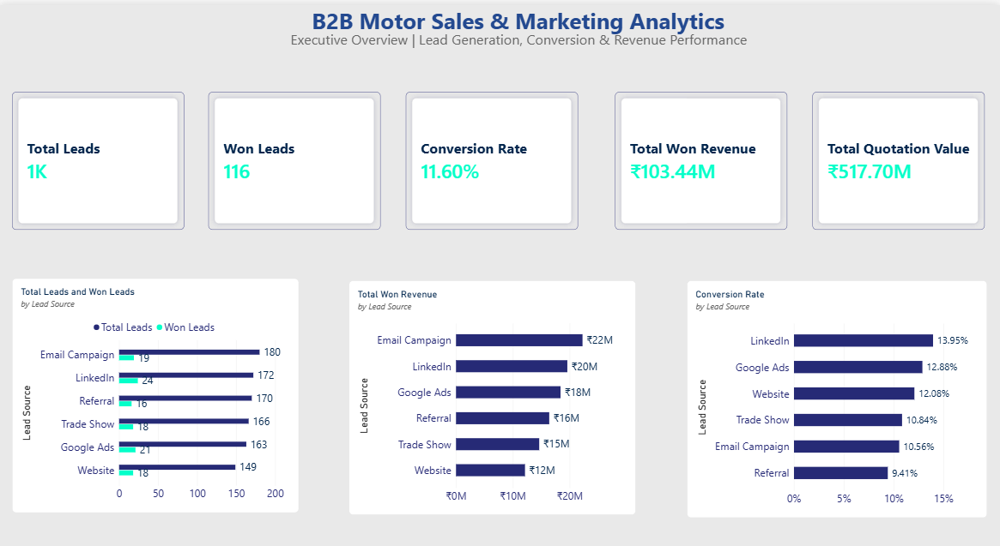
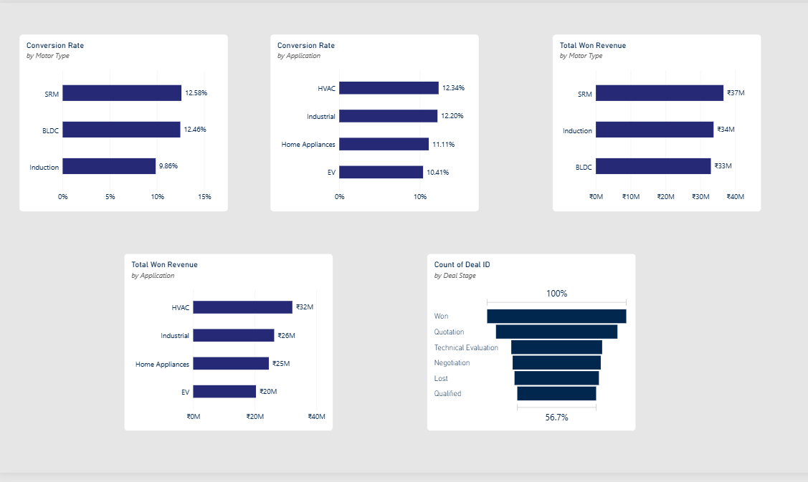
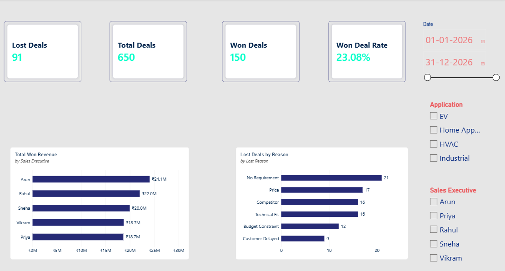

# B2B Motor Sales & Marketing Analytics

## Project Overview

A Business Analyst and Power BI portfolio project focused on analyzing B2B motor sales and marketing performance using a simulated CRM dataset.

The project analyzes the complete journey from lead generation to deal closure, including lead sources, conversion, sales pipeline, quotation value, won revenue, motor technology, application, sales executives, and lost-deal reasons.

## Business Problem

A B2B motor technology company generates leads through multiple channels such as Website, Google Ads, LinkedIn, Trade Shows, Referrals, and Email Campaigns.

Without a centralized view of lead conversion, sales pipeline, quotation value, won revenue, product performance, and loss reasons, management has limited visibility into sales and marketing performance.

This project addresses the need for a consolidated analytical dashboard to support data-driven sales and marketing decisions.

## Business Objectives

- Analyze lead generation by source and campaign
- Measure lead conversion performance
- Monitor sales pipeline and deal stages
- Analyze quotation value and won revenue
- Compare performance across motor technologies
- Analyze performance by application
- Evaluate sales executive performance
- Identify major reasons for lost deals
- Provide actionable business insights

## Key KPIs

- Total Leads
- Won Leads
- Lead Conversion Rate
- Total Quotation Value
- Total Won Revenue
- Total Deals
- Won Deals
- Lost Deals
- Deal Win Rate

## Technology & Tools

- Microsoft Power BI
- Power Query
- DAX
- Microsoft Excel
- Business Analysis / BA Documentation

## Dataset

The project uses a **synthetic CRM-style dataset** created specifically for portfolio and learning purposes.

The dataset contains:

- 1,000 Leads
- 220 Accounts
- 320 Contacts
- 650 Deals
- Date Table

The data represents a simulated B2B motor technology business covering:

- SRM Motors
- BLDC Motors
- Induction Motors
- Motor Controllers
- Integrated Motor Drives

Applications include:

- EV
- Home Appliances
- Industrial
- HVAC

## Power BI Dashboard

### Page 1 — Executive Overview

Analyzes:

- Total Leads
- Won Leads
- Lead Conversion Rate
- Total Quotation Value
- Total Won Revenue
- Lead Source Performance
- Conversion Rate by Lead Source
- Won Revenue by Lead Source

### Page 2 — Product & Market Analysis

Analyzes:

- Conversion Rate by Motor Type
- Conversion Rate by Application
- Won Revenue by Motor Type
- Won Revenue by Application
- Sales Pipeline by Deal Stage
- Won Revenue by Sales Executive

### Page 3 — Sales Pipeline & Loss Analysis

Analyzes:

- Total Deals
- Won Deals
- Deal Win Rate
- Lost Deals
- Sales Pipeline
- Lost Deals by Reason
- Sales Executive Performance
- Application Performance

## Key Business Insights

- LinkedIn and Google Ads show relatively stronger lead conversion performance.
- SRM and BLDC show higher lead conversion rates compared with Induction.
- HVAC and Industrial applications show relatively stronger conversion performance.
- SRM generates the highest won revenue among the motor technologies.
- HVAC generates the highest won revenue among applications.
- "No Requirement" is the largest identified lost-deal reason.
- Price, Competitor, and Technical Fit are also significant loss drivers.
- The sales pipeline contains a significant number of opportunities across intermediate deal stages.

## Business Recommendations

- Strengthen high-performing lead channels.
- Improve lead qualification to reduce "No Requirement" losses.
- Review pricing and competitive positioning.
- Improve technical solution alignment with customer requirements.
- Investigate opportunities in high-performing applications.
- Closely monitor pipeline movement and deal conversion.

## Business Analysis Documentation

The project includes Business Analysis documentation covering:

- Project Overview
- Business Problem
- Business Objectives
- Stakeholders
- Business Requirements
- KPIs & Metrics
- Data Sources
- Data Model
- Dashboard Requirements
- Business Insights
- Assumptions & Limitations
- Project Conclusion

## Project Structure

```text
b2b-sales-marketing-analytics
│
├── PowerBI
│   ├── B2B Motor Sales & Marketing Analytics.pbix
│   └── README.md
│
└── Project-01-B2B-Sales-Marketing-Analytics
    ├── BA-Documentation
    │   ├── B2B_Motor_Sales_Marketing_BA_Documentation.docx
    │   └── README.md
    │
    ├── Dataset
    │   ├── README.md
    │   └── b2b_motor_sales_marketing_powerbi_sample.xlsx
    │
    ├── Insights
    │   └── README.md
    │
    ├── Executive-Overview.png.png
    │
    └── README.md


## Power BI Dashboard



[Download Power BI Dashboard File](../PowerBI/B2B%20Motor%20Sales%20%26%20Marketing%20Analytics.pbix)

### Product & Market Analysis



### Sales Pipeline & Loss Analysis


